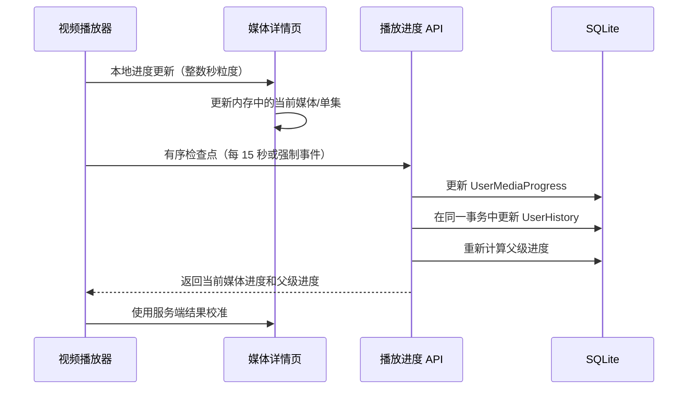

# feat: 记住每个用户的媒体播放进度

## 概述

本 PR 在保留现有播放历史功能的基础上，为本地媒体增加按用户持久化的播放进度。

用户现在可以：

- 查看电影或番剧处于未观看、观看中还是已看完状态；
- 从上次保存的位置继续播放未看完的视频；
- 在视频设置中关闭自动续播；
- 将电影、单集或整部番剧标记为看过；
- 查看单集状态以及整部番剧的聚合状态；
- 退出播放器后立即看到更新后的状态，无需重新加载完整详情页。

实现中有意区分了两个概念：

- `UserHistory` 继续表示仪表盘使用的最近播放历史；
- `UserMediaProgress` 表示某个用户对某个媒体条目的持久化当前状态。

## 改动动机

改动前，视频播放器只在销毁时写入一次历史记录。这足以支持最近播放列表，但无法可靠回答以下问题：

- 应该从哪里继续播放；
- 某一集是否已经看完；
- 一部番剧中还有哪些集没有看完；
- 父级番剧是否应该视为已经看完；
- 退出播放器后如何立即更新详情页状态。

只在播放器销毁时保存也不够可靠，因为浏览器标签页、移动端 WebView 或应用进程可能在最终请求完成前被关闭。

## 用户可见行为

### 进度状态

- 观看进度低于 80% 时状态为 `watching`。
- 观看进度达到或超过 80% 时状态为 `watched`。
- 用户可以主动将媒体标记为看过。
- 再次开始播放时，会有意使用新的播放状态替换手动标记状态。这符合“重播会开启新的当前观看状态”的预期行为。

### 自动续播

- 自动续播默认开启。
- 只有状态为 `watching` 且保存位置大于零的媒体才会自动续播。
- 播放器会短暂显示续播提示，并提供“从头开始”操作。
- 该设置沿用现有的视频持久化设置；对于保存于此字段加入之前的旧设置，运行时会自动使用默认值，因此保持向后兼容。

### 番剧和单集展示

- 媒体库卡片会在存在进度时显示“正在看”或“看过”。
- 详情页会展示父级媒体以及每个可见单集/分段的进度。
- 在播放器中选择章节时，会加载对应单集，通过统一的受控播放器流程切换视频流，并同时应用该集的保存位置和记录目标。

## 架构



详情页不会在每次检查点保存后重新加载完整媒体数据。本地进度负责提供即时的界面反馈，服务端响应只校准受影响的媒体条目及其父级。

## 播放生命周期

### 开始播放

1. 详情页加载媒体条目和对应进度记录。
2. 将选中的媒体和已保存进度传给 `VideoPlayer`。
3. 自动续播开启时，播放器应用保存的播放位置。
4. 第一次有效的时间更新会立即创建服务端检查点。

### 播放过程中

- 播放器根据媒体元素计算 `position` 和 `percentage`。
- 详情页最多每个整数播放秒接收一次本地更新。
- 常规服务端写入被限制为每 15 秒一次。
- 所有写入共用一条有序 Promise 队列，避免旧请求晚于新请求完成并覆盖新进度。

### 强制检查点

发生以下情况时，检查点不受 15 秒节流限制：

- 暂停播放；
- 播放结束；
- 用户切换到另一集；
- 播放器组件销毁；
- 文档进入隐藏状态；
- 页面触发 `pagehide`。

在浏览器支持时，请求会使用 `keepalive`。浏览器或 WebView 仍可能在最终请求完成前直接终止，因此周期检查点依然是必要的。

### 切换剧集

剧集切换使用统一的受控流程，不再混用插件默认切换和页面级切换：

1. 章节插件报告用户选择的章节。
2. 详情页加载目标媒体及其进度。
3. 播放器在修改活动媒体 ID 前保存上一集的最终检查点。
4. `playNext` 一次性切换视频流、标题、进度记录目标和续播位置。

对重叠的章节请求增加了顺序保护，因此较慢的旧请求不会覆盖较新的用户选择。如果服务端响应暂时落后于本地检查点，则保留更新的本地进度。

## 后端改动

### 数据库模型

新增 `user_media_progress` 表，包含以下字段：

| 字段 | 用途 |
| --- | --- |
| `user_id` | 进度记录所属用户 |
| `media_id` | 被记录的媒体条目 |
| `position` | 最后播放位置，单位为秒 |
| `percentage` | 0 到 100 的整数观看百分比 |
| `status` | `watching` 或 `watched` |
| `manual` | 当前看过状态是否由用户手动设置 |
| `created_at` / `updated_at` | 标准模型时间戳 |

`(user_id, media_id)` 具有唯一约束。两个外键均使用级联删除，因此删除用户或媒体条目时也会删除对应进度。

迁移文件为 `0004_user_media_progress.py`，依赖 `0003_auto_20260531_1044`。

### API 接口

#### `POST /media/progress/list`

请求：

```json
{
  "ids": [1, 2, 3]
}
```

- 只返回当前用户自己的进度。
- 非管理员用户只能读取其获授权媒体库中的进度。
- 前端会按最多 999 个 ID 自动分批请求。

#### `POST /media/progress/record`

请求：

```json
{
  "media_id": 2,
  "position": 742,
  "percentage": 38
}
```

响应数据：

```json
{
  "progress": {},
  "parent_progress": {}
}
```

该事务会：

1. 验证媒体条目存在且属于当前用户可访问的媒体库；
2. 更新当前用户和媒体对应的进度记录；
3. 更新现有视频播放历史；
4. 在适用时重新计算父级聚合状态。

周期检查点**不会**增加 `UserHistory.repetitions`。原有历史接口继续保留其默认行为，用于真正的重复历史事件。

#### `POST /media/progress/mark`

将一个可访问的媒体条目标记为看过，并返回与记录接口相同的当前媒体/父级响应结构。

### 父级聚合

对于同一父级下的所有可见子条目：

- 如果每个子条目都有 `watched` 记录，则父级状态为 `watched`，进度为 100%；
- 否则父级状态为 `watching`，进度为已记录子条目百分比之和除以可见子条目总数；
- 未完成的聚合百分比最高限制为 99%；
- 手动标记的父级不会被子条目聚合覆盖，直到用户直接播放该父级并有意产生新的非手动状态。

## SQLite 并发处理

容器原先使用 `--fast` 启动 Sanic，这会创建多个 worker 进程。SQLite 同一时间只允许一个写入者，并发写入进度和播放历史时会间歇性出现 `database is locked`。

本 PR 进行了两项相关调整：

1. 进度和视频播放历史通过同一个接口、同一个事务更新；
2. SQLite 容器移除 `--fast`，使用单个 Sanic worker。

权衡：单 worker 会降低 CPU 密集型请求的并行能力，并且不具备 worker 级故障接管。应用本身仍然使用异步 I/O，FFmpeg 和 aria2 也仍然运行在独立进程中。对于当前固定使用 SQLite 的配置，可靠写入比多进程请求吞吐更重要。

如果项目以后支持 PostgreSQL 或其他支持并发写入的数据库，可以只对这些后端有条件地恢复多 worker 启动。

## 兼容性

- 现有 `UserHistory` 数据不会被迁移或删除。
- 仪表盘原有历史播放功能继续工作，现在还会把媒体 ID 传给播放器。
- 旧视频设置中即使没有 `autoResume`，运行时也会默认使用 `true`。
- 网页搜索视频播放没有本地媒体 ID，因此保持原有行为。
- 进度接口要求用户登录，并遵守媒体库权限边界。
- 新表是纯增量改动，现有媒体和用户表结构不变。

## 性能考虑

- 详情页进度更新在本地完成，不会重新加载元数据、海报、演职人员或剧集列表。
- 本地界面以整数秒为粒度更新，而不是响应每一个原始 `timeupdate` 事件。
- 每个活动播放器的常规数据库写入最多每 15 秒一次。
- 检查点请求按顺序串行执行。
- 媒体列表每页使用一次批量进度请求；对于异常庞大的详情集合，会自动拆分成多个 999 ID 批次。
- 父级聚合只查询可见的同级媒体，并在进度事务内执行。

## 开发过程中已解决的审查问题

- 修复自定义章节回调阻止章节插件切换视频流的问题。
- 确保修改活动媒体 ID 前先保存上一集。
- 防止过期章节请求在较新选择完成后覆盖当前状态。
- 移除会把服务端错误伪装成“未观看”的静默进度加载失败处理。
- 为进度读取和写入增加媒体库权限过滤。
- 串行化写入，避免旧进度请求覆盖新进度。
- 防止周期检查点每 15 秒错误增加一次历史 `repetitions`。
- 播放完成或手动标记后不再重新加载整个详情页。

## 验证结果

以下检查均已成功完成：

- `npm run check`：0 个错误、0 个警告；
- `npm run build`：SvelteKit 生产构建成功；
- `ruff check app tests`：通过；
- `python -m compileall -q app tests`：通过；
- 在构建后的容器中运行后端完整测试：**273 项通过**；
- `git diff --check`：通过；
- 完整 Docker 镜像构建：通过。

前端构建仍会报告仓库原有的大体积 chunk/PWA 预缓存警告，本改动没有引入该警告。

在本地 Windows 检出中，作者原始的 `RUN chmod +x /app/entrypoint.sh` 可能受到 Docker heredoc CRLF 转换影响。仅适用于本地环境的 `sed -i 's/\r$//'` 规避方式被有意排除在本 PR 之外。最终运行时冒烟测试应在使用 LF 源文件的 Linux/CI 环境中完成。

## 人工验收清单

- [ ] 在已有工作区上应用迁移 `0004_user_media_progress`。
- [ ] 播放一个未观看的电影，退出播放器后确认详情页立即变为“正在看”。
- [ ] 再次打开该电影，确认自动从保存位置继续播放。
- [ ] 关闭自动续播，确认视频从头开始播放。
- [ ] 在续播提示中使用“从头开始”。
- [ ] 暂停播放并刷新页面，确认播放位置仍然保留。
- [ ] 关闭页面或将页面切到后台，确认最多只损失一个检查点周期的进度。
- [ ] 从播放器章节列表切换剧集，确认视频流、标题、记录目标和续播位置同步切换。
- [ ] 快速连续切换剧集，确认最后一次选择生效。
- [ ] 将某一集播放到 80% 以上，确认状态变为“看过”。
- [ ] 确认只有全部可见子条目都看完后，父级番剧才变为“看过”。
- [ ] 分别手动标记单集和父级番剧为看过。
- [ ] 重播手动标记的媒体，确认它按设计进入新的播放状态。
- [ ] 使用受限的非管理员用户，确认其无法读取或写入未授权媒体库的进度。
- [ ] 确认最近播放仍会出现在仪表盘中。
- [ ] 确认周期检查点不会增加历史重复次数。
- [ ] 在 Linux 上运行容器，确认 Sanic 使用单 worker 启动且不再出现 SQLite 写锁错误。

## 回滚方式

由于该功能是增量改动，应用代码可以直接回滚。如果只回滚应用而不逆向迁移，旧版本会忽略 `user_media_progress` 表。如果必须删除该表，请先备份工作区数据库，然后使用迁移框架逆向执行迁移 `0004`，或显式删除 `user_media_progress` 表。
