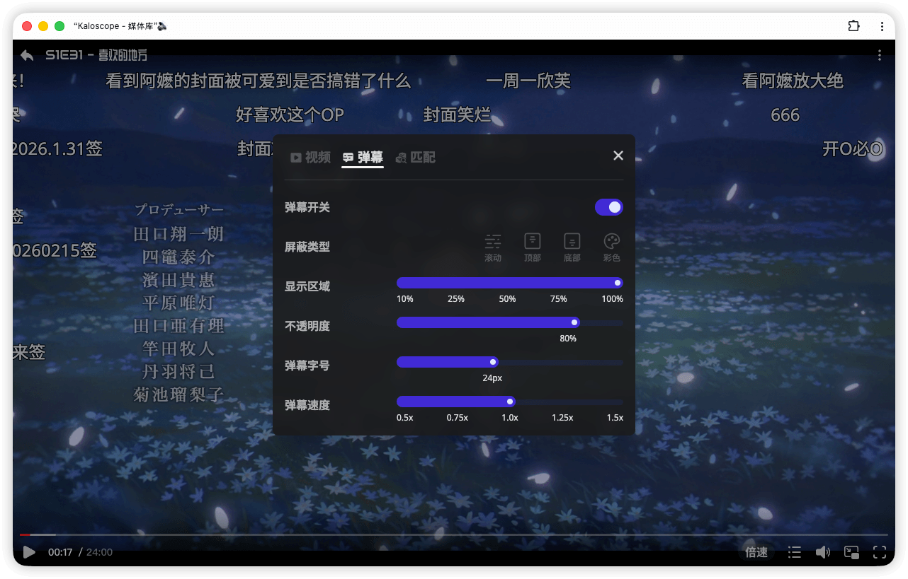
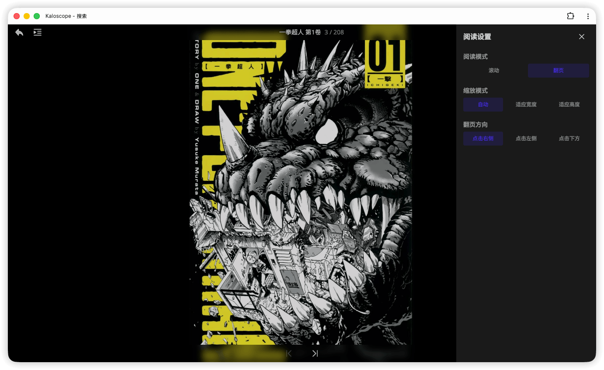
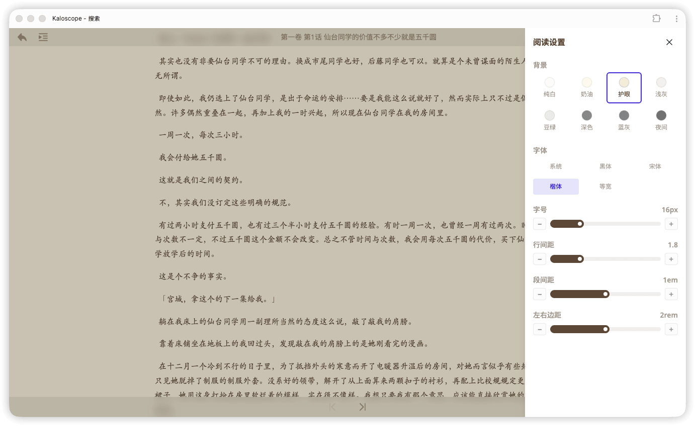

<div align="center">


[](https://github.com/kaloscope/kaloscope/releases)
[](https://hub.docker.com/r/kaloscope/kaloscope)
[](https://xyflow.com/)
[](https://svelte.dev/)
[](https://sanic.dev/)
[](https://www.python.org/)
[](LICENSE)
[![linux.do](https://img.shields.io/badge/LINUX-DO-FFB003.svg?logo=data:image/svg%2bxml;base64,DQo8c3ZnIHhtbG5zPSJodHRwOi8vd3d3LnczLm9yZy8yMDAwL3N2ZyIgd2lkdGg9IjEwMCIgaGVpZ2h0PSIxMDAiPjxwYXRoIGQ9Ik00Ni44Mi0uMDU1aDYuMjVxMjMuOTY5IDIuMDYyIDM4IDIxLjQyNmM1LjI1OCA3LjY3NiA4LjIxNSAxNi4xNTYgOC44NzUgMjUuNDV2Ni4yNXEtMi4wNjQgMjMuOTY4LTIxLjQzIDM4LTExLjUxMiA3Ljg4NS0yNS40NDUgOC44NzRoLTYuMjVxLTIzLjk3LTIuMDY0LTM4LjAwNC0yMS40M1EuOTcxIDY3LjA1Ni0uMDU0IDUzLjE4di02LjQ3M0MxLjM2MiAzMC43ODEgOC41MDMgMTguMTQ4IDIxLjM3IDguODE3IDI5LjA0NyAzLjU2MiAzNy41MjcuNjA0IDQ2LjgyMS0uMDU2IiBzdHlsZT0ic3Ryb2tlOm5vbmU7ZmlsbC1ydWxlOmV2ZW5vZGQ7ZmlsbDojZWNlY2VjO2ZpbGwtb3BhY2l0eToxIi8+PHBhdGggZD0iTTQ3LjI2NiAyLjk1N3EyMi41My0uNjUgMzcuNzc3IDE1LjczOGE0OS43IDQ5LjcgMCAwIDEgNi44NjcgMTAuMTU3cS00MS45NjQuMjIyLTgzLjkzIDAgOS43NS0xOC42MTYgMzAuMDI0LTI0LjM4N2E2MSA2MSAwIDAgMSA5LjI2Mi0xLjUwOCIgc3R5bGU9InN0cm9rZTpub25lO2ZpbGwtcnVsZTpldmVub2RkO2ZpbGw6IzE5MTkxOTtmaWxsLW9wYWNpdHk6MSIvPjxwYXRoIGQ9Ik03Ljk4IDcwLjkyNmMyNy45NzctLjAzNSA1NS45NTQgMCA4My45My4xMTNRODMuNDI2IDg3LjQ3MyA2Ni4xMyA5NC4wODZxLTE4LjgxIDYuNTQ0LTM2LjgzMi0xLjg5OC0xNC4yMDMtNy4wOS0yMS4zMTctMjEuMjYyIiBzdHlsZT0ic3Ryb2tlOm5vbmU7ZmlsbC1ydWxlOmV2ZW5vZGQ7ZmlsbDojZjlhZjAwO2ZpbGwtb3BhY2l0eToxIi8+PC9zdmc+&style=flat-square)](https://linux.do)
[](https://t.me/kaloscope_official)

|  |  |  |
| ------------------------------------------------------------- | --------------------------------------------------------- | -------------------------------------------------------- |

</div>

## 项目简介

Kaloscope 是一款基于可视化工作流引擎的本地媒体库管理工具。其资源搜索与元数据刮削等能力均由可编辑的工作流来驱动，可灵活对接任意资源站点与元数据来源。

## 快速开始

通过 Docker 命令行直接拉取并运行单个 Kaloscope 容器的示例：

```bash
docker run -d \
  --name kaloscope \
  --add-host=host.docker.internal:host-gateway \
  -e PUID=1026 \
  -e PGID=100 \
  -e UMASK=022 \
  -e TZ=Asia/Shanghai \
  -e AUTO_TLS=true \
  -e TLS_HOSTNAME=192.168.31.2 \
  -e ENABLE_ARIA2=true \
  -v /volume1/kaloscope/workspace:/workspace \
  -v /volume1/kaloscope/downloads:/downloads \
  -v /volume1/kaloscope/animes:/animes \
  -p 8000:8000 \
  -p 6888:6888 \
  -p 6888:6888/udp \
  --restart unless-stopped \
  kaloscope/kaloscope:latest
```

上例中各参数说明如下：

**环境变量（`-e`）**

| 变量名         | 默认值  | 说明                                                                                                        |
| -------------- | ------- | ----------------------------------------------------------------------------------------------------------- |
| `PUID`         | `0`     | 进程运行 UID，NAS 环境建议设为媒体目录所有者                                                                |
| `PGID`         | `0`     | 进程运行 GID，NAS 环境建议设为媒体目录所属用户组                                                            |
| `UMASK`        | `022`   | 文件创建掩码，影响容器内新建文件的默认权限                                                                  |
| `TZ`           | 无      | 容器时区，如 `Asia/Shanghai`、`UTC` 等                                                                      |
| `AUTO_TLS`     | `false` | 使用 [mkcert](https://github.com/FiloSottile/mkcert) 自动签发本地 TLS 证书，适合需要局域网 HTTPS 访问的用户 |
| `TLS_HOSTNAME` | 无      | 指定 TLS 证书绑定的主机名或 IP，`AUTO_TLS=true` 时生效                                                      |
| `ENABLE_ARIA2` | `false` | 在容器内启动内置的 aria2 服务，适合不想单独部署下载器的用户                                                 |

**端口映射（`-p`）**

| 端口   | 协议    | 说明                                                          |
| ------ | ------- | ------------------------------------------------------------- |
| `8000` | TCP     | Kaloscope Web UI 访问端口                                     |
| `6888` | TCP/UDP | aria2 DHT 与 BT 监听端口（仅 `ENABLE_ARIA2=true` 时需要映射） |

**数据卷（`-v`）**

| 容器内路径   | 必要性 | 说明                                     |
| ------------ | ------ | ---------------------------------------- |
| `/workspace` | 必须   | 持久化存储目录，保证容器重启后数据不丢失 |

> 更多详细配置说明请参考 [项目部署文档](https://kaloscope.org/docs/deployment)。

## 功能特性

### :wrench: 工作流

- 提供基于节点的可视化工作流编辑器，拖拽即可搭建业务流程
- 内置 HTTP 请求、Python 脚本、条件分支、循环控制等节点类型
- 支持从 GitHub 仓库导入社区工作流模板，快速复用已有方案
- 支持定时触发，可按计划自动执行工作流

### :mag: 资源搜索

- 索引器完全由工作流驱动，可对接任意资源站点
- 支持关键词搜索、详情预览、登录认证等完整交互流程
- 支持全局搜索，可同时聚合多个索引器的结果

### :inbox_tray: 下载管理

- 支持 [aria2](https://aria2.github.io/)、[qBittorrent](https://www.qbittorrent.org/)、[Transmission](https://transmissionbt.com/) 等下载器
- 下载器配置通过 YAML 定义，可按需扩展适配器
- 支持下载计划，可按关键词和过滤规则自动抓取并下发下载任务
- 支持手动添加磁力链接或种子文件

### :clapper: 媒体库管理

- 支持电影、电视剧等多种媒体库类型
- 支持实时监控文件系统，自动识别新加入的媒体文件
- 支持从 [NFO](http://wikipedia.org/wiki/.nfo) 文件中提取并解析元数据

### :arrow_forward: 在线播放

- 内置视频播放器，支持 FLV、HLS、MP4 格式
- 支持实时转码播放，按需将视频转为 HLS 流，可按画质限制输出
- 支持多种硬件加速编码（NVENC、VAAPI、VideoToolbox 等）
- 支持弹幕显示与移动端样式全屏播放
- 支持记录播放进度和续播

### :busts_in_silhouette: 用户权限

- 支持多用户，并区分管理员与普通用户角色
- 可按媒体库和索引器分配访问权限
- 支持个人偏好设置与头像自定义

### :iphone: PWA 支持

- 支持以 [PWA](https://web.dev/explore/progressive-web-apps) 方式安装到桌面或移动设备
- PWA 主题颜色可随应用内主题同步切换

## 相关链接

- [官网和文档](https://kaloscope.org)
- [工作流模板仓库](https://github.com/kaloscope/workflows)
- [Docker Hub 镜像](https://hub.docker.com/r/kaloscope/kaloscope)
- [Telegram 社群](https://t.me/kaloscope_official)

## 星标历史

[](https://www.star-history.com/?repos=kaloscope%2Fkaloscope&type=date&legend=top-left)

## 贡献者

感谢所有为本项目提交代码、文档、反馈和建议的贡献者。

[](https://github.com/kaloscope/kaloscope/graphs/contributors)

## 特别鸣谢

- **弹弹play开放平台**

  感谢[`弹弹play开放平台`](https://doc.dandanplay.com/open/)提供的弹幕服务接口支持。弹幕服务接口的相关代理实现见 [`kaloscope/danmaku`](https://github.com/kaloscope/danmaku) 仓库。

- **第三方依赖与开源社区**

  本项目构建在众多优秀的开源项目之上，感谢所有开发者与贡献者的持续投入。完整的第三方依赖列表及对应开源协议见 [`LICENSES.md`](LICENSES.md) 文件。

## 免责声明

- 本项目仅供个人学习与技术交流使用，禁止用于商业目的或传播违法内容
- 社区或第三方工作流可能包含任意代码或网络请求，使用者需自行审查验证其安全性与合法性
- 因使用本项目引发的一切法律责任、风险与损失，均由使用者自行承担，开发者不承担任何连带责任

## 开源协议

本项目基于 [GPLv3](LICENSE) 开源协议发布。
