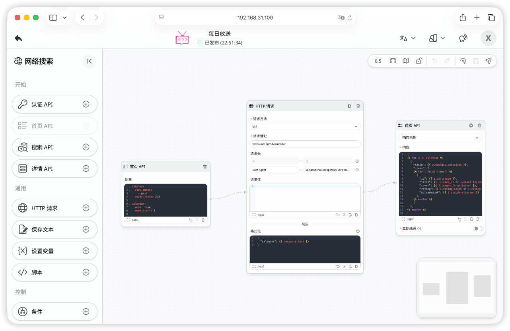

# Kaloscope

_以可视化工作流驱动的本地媒体库管理工具_

|  |  |
| ----------------------------------------------------- | ------------------------------------------------------ |

## 项目简介

Kaloscope 是一款基于可视化工作流引擎的本地媒体库管理工具。
其资源搜索与元数据刮削等操作均通过可编辑的工作流来实现，而非硬编码逻辑，可灵活对接任意资源站点与元数据来源。

## 免责声明

本项目仅供个人学习与技术交流使用，禁止用于商业目的或传播违法内容。
社区或第三方工作流可能包含任意代码或网络请求，使用者需自行审查验证其安全性与合法性。
因使用本项目引发的一切法律责任、风险与损失，均由使用者自行承担，开发者不承担任何连带责任。

## 功能特性

### :wrench: 工作流

- 基于节点的可视化工作流编辑器，拖拽即可搭建自定义流程
- 内置多种节点类型：HTTP 请求、Python 脚本、条件分支、循环控制等
- 支持从 GitHub 仓库导入社区工作流模板，一键复用
- 支持定时触发，可按计划自动执行工作流

### :mag: 资源搜索

- 索引器完全由工作流驱动，可对接任意资源站点
- 支持关键词搜索、详情预览、登录认证等完整交互流程
- 支持全局搜索，可同时在多个索引器中搜索资源并展示结果

### :inbox_tray: 下载管理

- 支持多种下载器：[aria2](https://aria2.github.io/)、[qBittorrent](https://www.qbittorrent.org/)、[Transmission](https://transmissionbt.com/)
- 下载器配置通过 YAML 定义，支持自定义适配更多下载器
- 支持下载计划，可按关键词与过滤规则自动从索引器抓取资源并下载
- 支持手动添加磁力链接或种子文件进行下载

### :clapper: 媒体库管理

- 支持电影、电视剧等媒体库类型
- 支持实时监控文件系统，自动识别新添加的媒体文件
- 支持从 NFO 文件中自动提取并解析元数据

### :arrow_forward: 在线播放

- 内置视频播放器，支持 FLV、HLS、MP4 格式
- 支持弹幕显示与移动端横屏播放
- 支持记录播放进度和续播

### :busts_in_silhouette: 用户权限

- 支持多用户，区分管理员和普通用户角色
- 可按媒体库和索引器分配访问权限
- 支持个人偏好设置与头像自定义

### :iphone: PWA 支持

- 支持以 [PWA](https://web.dev/explore/progressive-web-apps) 方式安装到桌面或移动设备
- 自动生成多尺寸图标

## 特别鸣谢

本项目基于众多优秀的开源项目构建而成，在此向所有这些项目的开发者和贡献者表示衷心的感谢。
完整的第三方依赖列表及其开源协议请查看 [LICENSES.md](LICENSES.md) 文件。

## 开源协议

本项目基于 [GPLv3](LICENSE) 开源协议发布。
