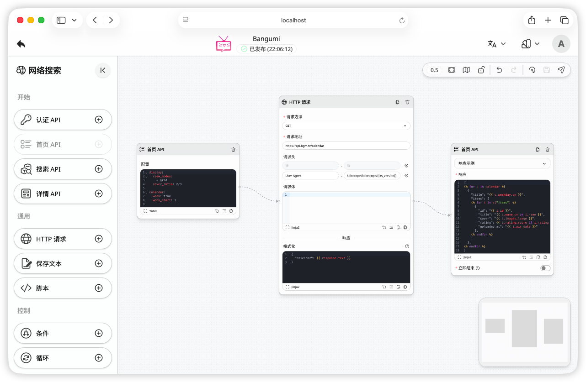

<div align="center">


# Kaloscope

_以可视化工作流驱动的媒体库管理与自动追番工具_

[](https://github.com/kaloscope/kaloscope/stargazers)
[](LICENSE)
[](https://xyflow.com/)
[](https://svelte.dev/)
[](https://sanic.dev/)
[](https://www.python.org/)



</div>

## 项目简介

Kaloscope 是一款基于可视化工作流引擎的本地媒体库管理工具。
其资源搜索与元数据刮削等操作均通过可编辑的工作流来实现，而非硬编码逻辑，可灵活对接任意资源站点与元数据来源。

## 免责声明

本项目仅供个人学习与技术交流使用，禁止用于商业目的或传播违法内容。
社区或第三方工作流可能包含任意代码或网络请求，使用者需自行审查验证其安全性与合法性。
因使用本项目引发的一切法律责任、风险与损失，均由使用者自行承担，开发者不承担任何连带责任。

## 功能特性

### :wrench: 工作流

- 基于节点的可视化工作流编辑器，拖拽即可搭建自定义流程
- 内置多种节点类型：HTTP 请求、Python 脚本、条件分支、循环控制等
- 支持从 GitHub 仓库导入社区工作流模板，一键复用
- 支持定时触发，可按计划自动执行工作流

### :mag: 资源搜索

- 索引器完全由工作流驱动，可对接任意资源站点
- 支持关键词搜索、详情预览、登录认证等完整交互流程
- 支持全局搜索，可同时在多个索引器中搜索资源并展示结果

### :clapper: 媒体库管理

- 支持电影、电视剧等媒体库类型
- 支持实时监控文件系统，自动识别新添加的媒体文件
- 支持从 NFO 文件中自动提取并解析元数据

### :inbox_tray: 下载管理

- 支持多种下载器：[aria2](https://aria2.github.io/)、[qBittorrent](https://www.qbittorrent.org/)、[Transmission](https://transmissionbt.com/)
- 下载器配置通过 YAML 定义，支持自定义适配更多下载器
- 支持下载计划，可按关键词与过滤规则自动从索引器抓取资源并下载
- 支持手动添加磁力链接或种子文件进行下载

### :arrow_forward: 在线播放

- 内置视频播放器，支持 FLV、HLS、MP4 格式
- 支持弹幕显示与移动端横屏播放
- 支持记录播放进度和续播

### :busts_in_silhouette: 用户权限

- 支持多用户，区分管理员和普通用户角色
- 可按媒体库和索引器分配访问权限
- 支持个人偏好设置与头像自定义

### :iphone: PWA 支持

- 支持以 PWA 方式安装到桌面或移动设备
- 自动生成多尺寸图标

### :globe_with_meridians: 国际化

- 支持简体中文和英文界面

## 开发指南

### 环境配置

开始之前，请先确保安装了以下开发环境和工具：

- [Git](https://git-scm.com/)
- [Python](https://www.python.org/)
- [Node.js](https://nodejs.org/)
- [Poetry](https://python-poetry.org/)
- [pnpm](https://pnpm.io/)

### 安装运行

1. 克隆本项目到本地

```bash
git clone https://github.com/kaloscope/kaloscope.git
cd kaloscope
```

2. 安装后端依赖并启动

```bash
cd backend
poetry install
poetry run sanic app.main:app --fast --reload --debug
```

3. 安装前端依赖并启动

```bash
cd frontend
pnpm install
pnpm run dev
```

4. 前后端均启动后，浏览器访问 `http://localhost:5173/` 即可进入应用界面，首次使用需创建管理员账户

### 项目结构

```
kaloscope/
├── frontend/
│   ├── src/                    # 前端代码
│   │   ├── routes/             # 页面路由
│   │   │   ├── login/          # 登录页
│   │   │   ├── setup/          # 初始设置页
│   │   │   └── (app)/          # 主功能页面
│   │   │       ├── dashboard/  # 首页
│   │   │       ├── websearch/  # 搜索
│   │   │       ├── medialibs/  # 媒体库
│   │   │       ├── downloads/  # 下载
│   │   │       └── settings/   # 设置
│   │   └── lib/                # 组件与工具库
│   └── static/                 # 静态资源
├── backend/
│   └── app/                    # 后端代码
│       ├── main.py             # 应用入口
│       ├── config.toml         # 配置文件
│       ├── routes/             # API 路由
│       ├── services/           # 业务逻辑
│       ├── models/             # 数据模型
│       ├── utils/              # 工具函数
│       └── core/               # 核心模块
│           ├── dl/             # 下载器适配
│           ├── flow/           # 工作流引擎
│           └── media/          # 媒体库管理
└── workspace/                  # 运行时数据
    ├── database/               # 数据库
    ├── images/                 # 图片缓存
    ├── downloads/              # 下载文件
    └── repositories/           # 工作流仓库
```

## 特别鸣谢

本项目基于众多优秀的开源项目构建而成，在此向所有这些项目的开发者和贡献者表示衷心的感谢。
完整的第三方依赖列表及其开源协议请查看 [LICENSES.md](LICENSES.md) 文件。

## 开源协议

本项目基于 [GPLv3](LICENSE) 开源协议发布。
